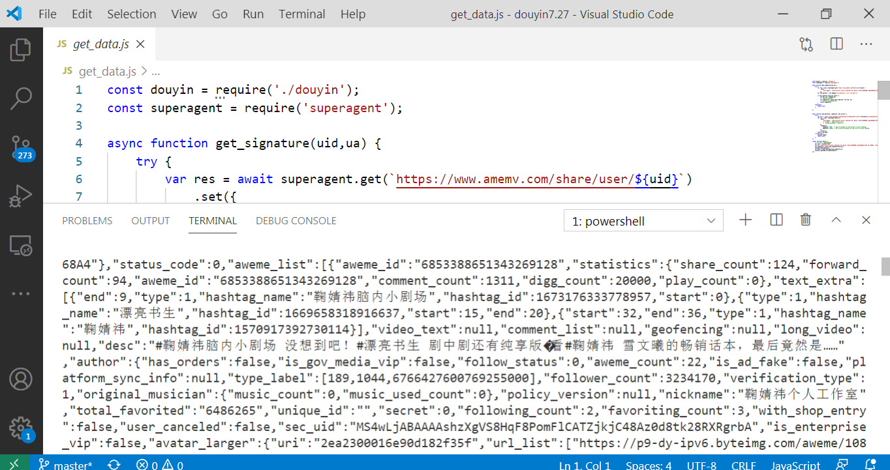

# douyin web 端 signature
[参考代码](https://github.com/CharlesPikachu/Video-Downloader)

## 更新

在抖音`douyin7.27`文件夹  
需要环境node.js  
superagent模块  

## 使用方法

到`douyin7.27`文件夹  

安装依赖
```
npm install superagent
```

## 获取数据

```
node get_data.js
```

**效果**



---
原来版本需要puppeteer

## 环境需求
### node puppeteer express superagent
自行npm 或 cnpm 安装


## 在本地搭建服务生成指定uid的signature
### 搭建完成后

可请求接口

`
http://localhost:5000/user?uid=102064772608
`

返回内容示例


## 更进一步传入uid直接返回主页json数据
请求接口

`
http://localhost:5000/data?uid=102064772608
`

返回内容示例


## 文件夹介绍
服务搭建的代码在node_douyin_service2文件夹

python调用服务示例在douyinpy文件夹

## 总结
思路几乎照抄https://github.com/coder-fly/douyin-signature
只不过改成了puppeteer+express搭建服务（原来是pyppeteer）

尝试过在node环境中计算signature奈何那段签名算法混淆太牛逼无法移除检测环境的代码，最后用了puppeteer驱动chromium，并用express做成服务。
核心逻辑是
1.得到uid请求源码达到tac

2.puppeteer驱动chromium在console中执行签名算法

3.返回signature

尝试获取代码获取完整tac并进行传递，但发现代码获取的tac与浏览器中的不同（原因可能是特殊字符的编码问题），所以只获取tac的前一小部分。
传递前用base64编码防止因特殊字符的存在产生各种问题。

### 总结一下两个未解决的问题
##### 代码获取完整且编码正确的tac
##### 去除签名算法中的环境监测使其可以在node环境运行并得到正确结果

