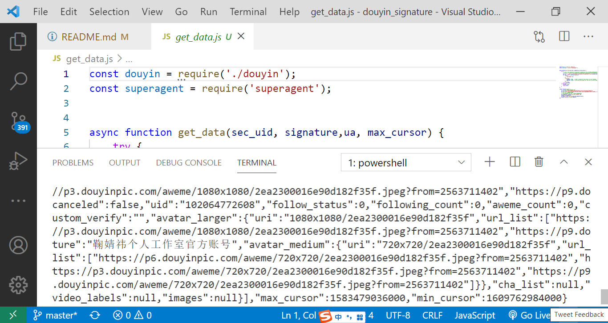

# douyin web signature
此项目仅用于科研学习，请勿用于商业用途否则造成的后果与作者无关

# usage
## install dependencies
```
npm install
```
## get data
```
node get_data.js
```

## example


## others
1. 使用`sec_uid`代替`uid`来区分用户，需要得到用户的`sec_id`以获取该用户的所有作品  
2. `uid` `useragent` `sec_uid` 和`signature`并没有绑定  
3. 这个版本校验较弱可能只是过渡版本，可能很快失效  

## 浏览器环境补充
[canvas相关环境补充](./canvas相关环境补充/readme.md)