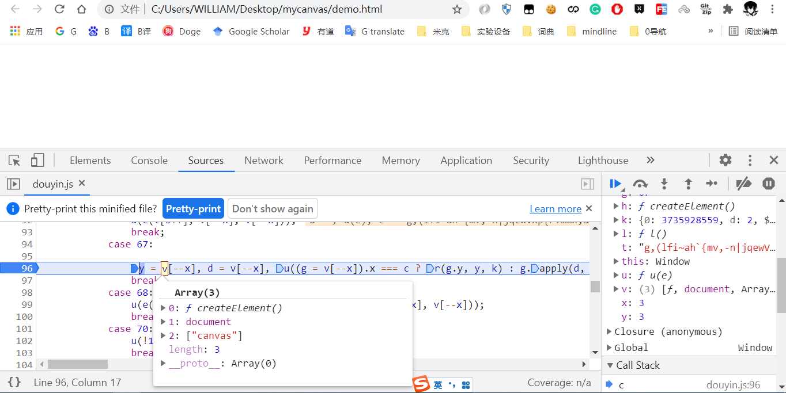
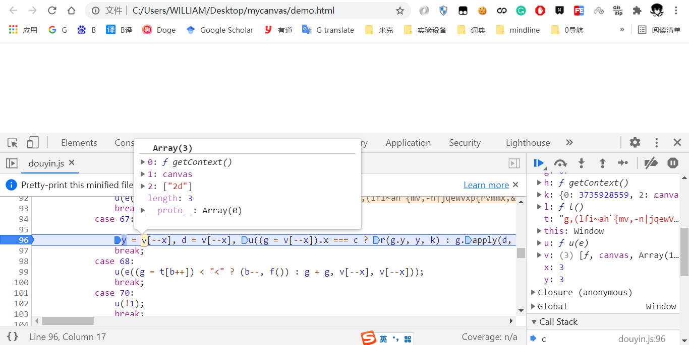
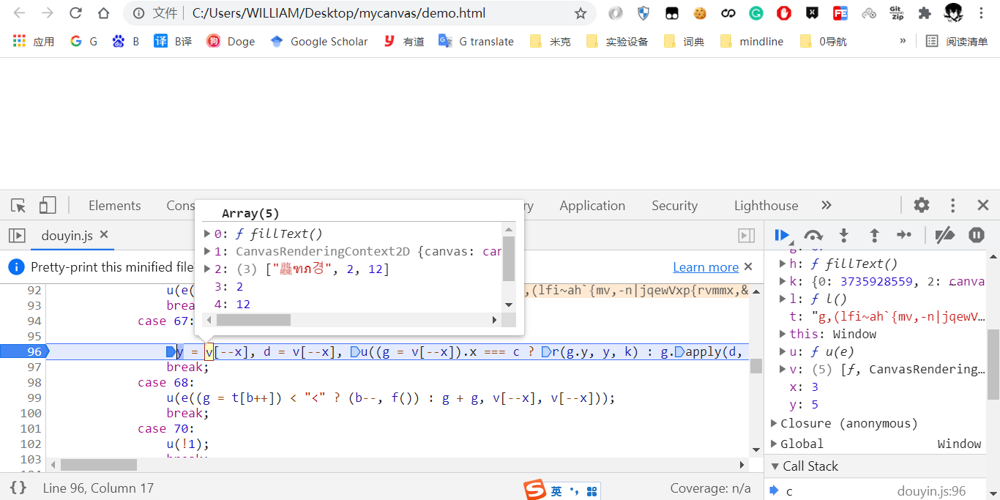
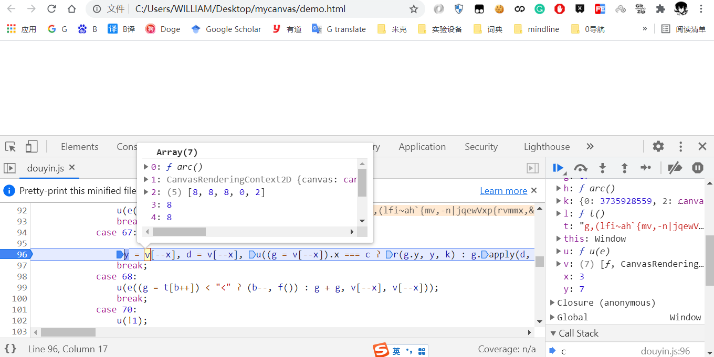
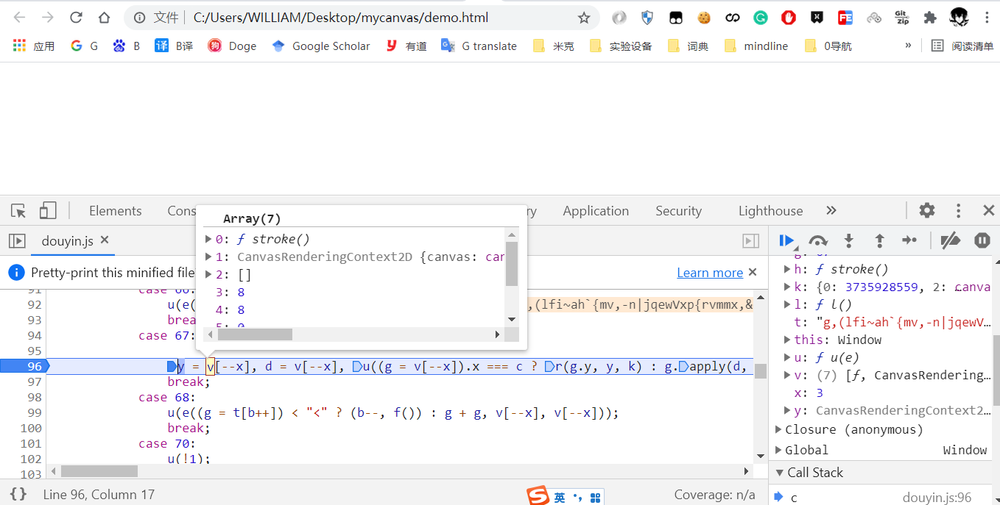
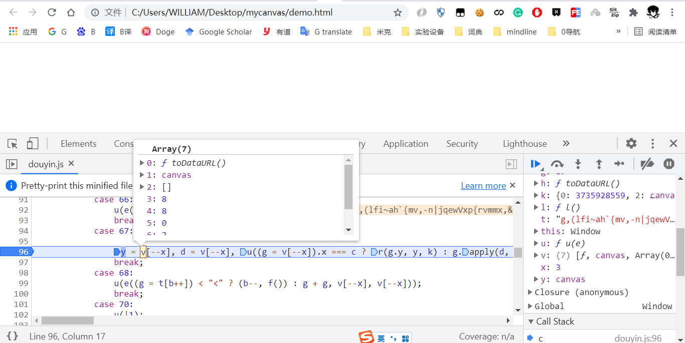
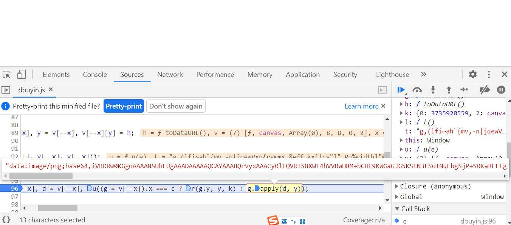

# canvas相关环境监测








以上代码与如下代码功能上相似，以下代码可以直接在浏览器控制台输出  
```
var canvas = document.createElement.apply(document,["canvas"])
canvas.width  = 48;
canvas.height = 16;
var CanvasRC2D = canvas.getContext.apply(canvas,["2d"])
CanvasRC2D.fillText.apply(CanvasRC2D,["龘ฑภ경", 2, 12])
CanvasRC2D.arc.apply(CanvasRC2D,[8, 8, 8, 0, 2])
CanvasRC2D.stroke.apply(CanvasRC2D,[])
canvas.toDataURL.apply(canvas,[])
```

因此签名算法中canvas相关的环境可以这样补充  
```
document = {
    createElement: function() {
        return canvas
    }
};
canvas = {
    getContext: function getContext() {
        return CanvasRenderingContext2D
    },
    toDataURL: function toDataURL() {
        return "data:image/png;base64,iVBORw0KGgoAAAANSUhEUgAAADAAAAAQCAYAAABQrvyxAAACyUlEQVRIS8XWTYhVZRgH8N8dkPFqJqgI4sKmTUSgaBCKihCI5dZFUEaLwHAThjujEnXjpkAUHSRc+AEtFJIWKWRBSR9QENgiggplNqkTlXBnhjveeM6cF955PXccFJ2zuPec99zz3v/X87+3ZfrRK67jslWvxb103vCxx770DN5sApSAloBLco+SzFKcxbZClmG8gw7uIdCkfnq+BDsXbmzEizhYg2p0oEn1PEK5II/SgTKPbXyE89iBt+oPDDcpWz7cbwZysq/h9Vqd9/E2fkWsn0GsJeVi/1DvE6xJQLJoNA1T7PN0wx73zMBMDsTGTXMQ1n6TAfkJ63ACr+IcDmekUr6D0FUkdb+uc18SCPCba4ILitlodGA2ik8R7Rmw2E4ThnR9oVsRjJyuxL/4FLdwJCOQE07O5CBjQONIRINk7l4iOOMQB4mkdn6eajWgM2mhYU855KhRXRMO6DqKD/Ay3sWygkCKUE6qJPAegmis3+5T0I0EEtj8PUVn+r2e+Zb52HqjPqti8ptFnnPHPhzH6lq5+KIcbOwX4AJkAtjkQK50Pi9pfWfEKR/ifjVaOjC1wcLq9ZoPXbTLZfyi7Vljlep/4nSd8ZzA9bpNokUuzYJASTSBT3Mzcr8qbO77CNBSk0ZNGrPHoO+r1plnta4YxhxcTiAAbMcPs3QgXLpSC1EmKfbd38+B/jMQ4NvuWoTlPnfNKfyIES3P142U12Y/B6oI1Kj6RSgcOIZX6lqe0YHyL0Su/tT5gJ5JbSt03PSfrl34vco//2i522fgHma5/M1Ie20KZ0oHEsj5Fhireqijra2j4wlL3HHMGrv9bC2+tKUGf1vLxMOgfNBnp89AT8sGq3xrHE/WVRo0ojQHvWSHK/Y6ab83qhz/gZsYr34V5uAoCQwYstV1F6zzlXlaxg0aMeQvq7zgqu+qno+WuYG/5xJ86PU//5znHgwZKlQAAAAASUVORK5CYII="
    },
}

CanvasRenderingContext2D = {
    arc: function arc() {},
    stroke: function stroke() {},
    fillText: function fillText() {},
}
```

另外再加上基本的window,navigator.useragent等环境就是该签名算法检测的完整浏览器环境